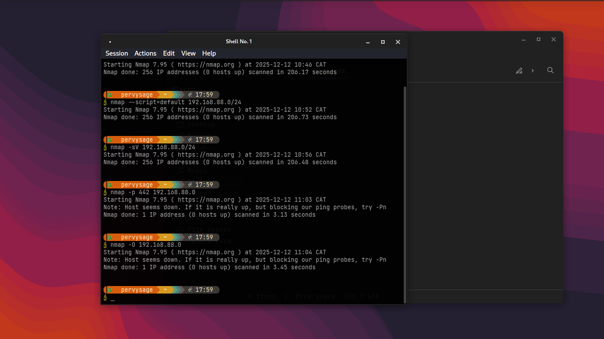
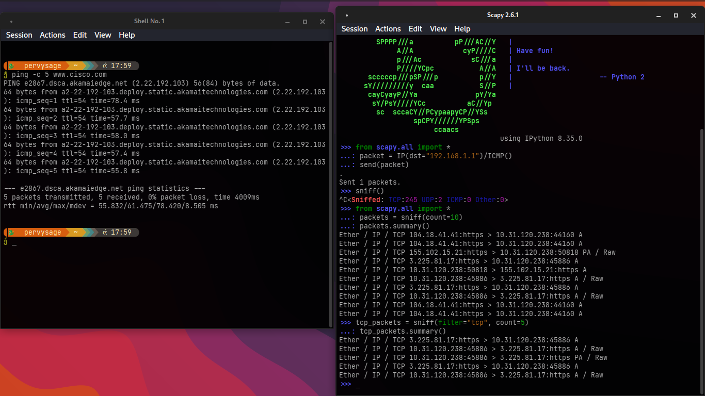

# Nmap & Scapy Lab Documentation

## Objectives
Reproduce Nmap and Scapy labs as taught in class, document the usage of both tools, and reflect on the experience and real-world value.

---

## Lab Setup
- **Operating System:*Kali-Linux*
- **Tools:** 
  - Nmap 7.95
  - Python 3.x with Scapy 2.6.1
- **Network:*home*

---

## Nmap Labs

### 1. Host Discovery, Service Detection, Port Scanning, OS Detection

**Commands Used:**
```bash
nmap --script=default 192.168.88.0/24
nmap -sV 192.168.88.0/24
nmap -p 442 192.168.88.0
nmap -O 192.168.88.0
```
   
**Screenshot:**  

Uploaded above 
**Explanation:**  
- `--script=default` runs default safe scripts for network exploration.
- `-sV` detects service versions.
- `-p` specifies the port(s) to scan.
- `-O` attempts OS detection.
- The output shows attempts to scan the subnet and single host. In this case, many hosts appeared down, which is sometimes due to firewall settings or disabled ping responses—a common issue in real-world assessments (suggests use of `-Pn` option).

---

## Scapy Labs

### 1. ICMP Packet Crafting and Sending

**Code Used:**
```python
from scapy.all import *
packet = IP(dst="192.168.1.1")/ICMP()
send(packet)
```

**Explanation:**  
This creates and sends an ICMP (ping) packet to the target IP using Scapy, showing how to directly craft and transmit packets at the network layer.

---

### 2. Capturing and Analyzing Packets

**Code Used:**
```python
from scapy.all import *
packets = sniff(count=10)
packets.summary()
# Filter for TCP only
tcp_packets = sniff(filter="tcp", count=5)
tcp_packets.summary()
```

**Screenshot:**  

uploaded above too

**Explanation:**  
- `sniff(count=10)` captures 10 packets on the default network interface.
- `.summary()` prints a quick overview of each captured packet (protocols, addresses, ports).
- Adding `filter="tcp"` narrows capture to TCP traffic.
- Useful in security testing and protocol analysis.

---

### 3. Real-World Example: Ping Test

**Command Used:**
```bash
ping -c 5 www.cisco.com
```

**Screenshot:**  
Included above with Scapy (left terminal).

**Explanation:**  
Verified Internet connectivity and how ICMP echo is used by many network utilities (useful concept for comparing Nmap and Scapy capabilities).

---

## Results and Learning Points

- Practiced both high-level (Nmap) and low-level (Scapy) network enumeration and analysis.
- Encountered realistic issues such as hosts not replying to probes due to firewall settings.
- Enhanced understanding of packet structures and protocol analysis.

---

## Reflection

See my post for a summary of my experience, challenges, and how these tools apply in practice:  
[https://www.linkedin.com/posts/wongani-nkosi-36b53b297_parocyber-rolandmawuliawuku-activity-7405174191014084608-GxSW?utm_source=share&utm_medium=member_desktop&rcm=ACoAAEfN60MB2cRurVzRPeCmTr_c6CHUqTW3MvA]

---

## References
- [Nmap Documentation](https://nmap.org/book/man-briefoptions.html)
- [Scapy Documentation](https://scapy.readthedocs.io/en/latest/)

---

**Note:**  
Screenshots were taken during actual lab work, showing commands and outputs for both Nmap and Scapy tools.
